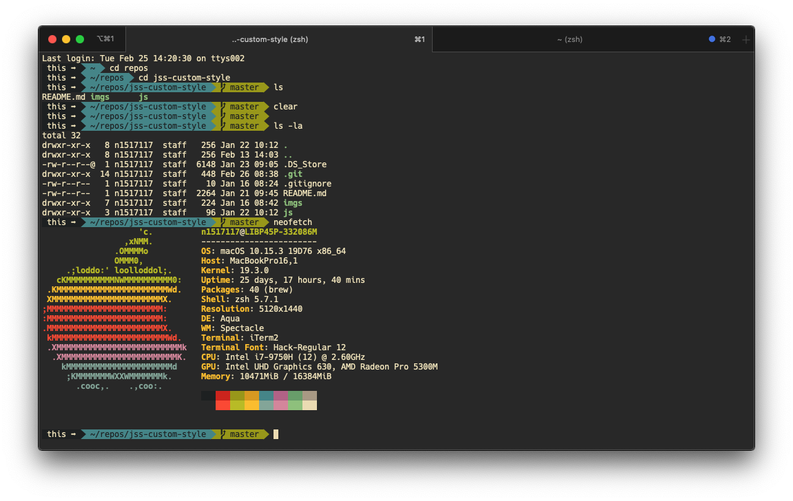

  

<h1 align="center">
  Gruvbox Theme for iTerm2
</h1>

  A minimal, dark theme based on the [Guvbox](https://github.com/morhetz/gruvbox-contrib) color scheme

## Installation

1. Clone this repo
1. In iTerm2 open `Preferences > Profiles`
1. Under the `Colors` tab find `Color Presets > Import`
1. Import the `gruvbox.itermcolors` file

## Settings

I'm currently using the [Agnoster Prompt/Theme](https://github.com/agnoster/agnoster-zsh-theme) for [Oh-My-Zsh](https://github.com/ohmyzsh/ohmyzsh)
